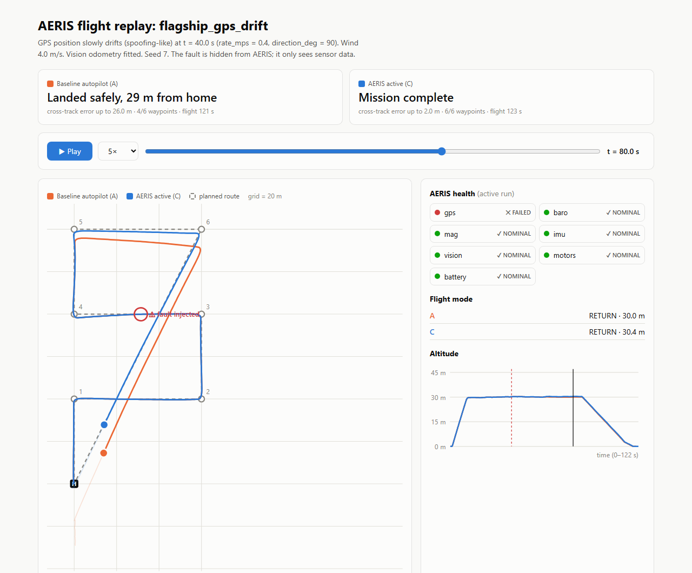

# AERIS: self-diagnosing aircraft digital twin

AERIS watches a simulated drone for sensor and hardware faults, works out what broke,
explains why it thinks so, and picks a recovery the aircraft can still fly. It
supervises the autopilot and never takes control away from it.



*A GPS that slowly drifts (like a spoofing attack) drags the baseline autopilot 26 m
off course. AERIS notices that GPS and vision odometry disagree, stops using GPS and
finishes the mission. Open [`docs/evidence/flagship_replay.html`](docs/evidence/flagship_replay.html)
in a browser to replay it.*

## Results

1,620 simulated flights on seeds never used for tuning: 42 evaluation scenarios per
fault type, each flown by the baseline autopilot alone (**A**) and with AERIS in
control (**C**). Detection figures come from runs where AERIS only watched (**B**).

| Fault | Detected | Median time to flag | Mission success A → C | Safe landing A → C | Crashes A → C |
|---|---|---|---|---|---|
| Barometer frozen | 100 % | 0.60 s | 2 % → **100 %** | 21 % → **100 %** | 21 % → **0 %** |
| GPS drift (spoofing-like) | 74 % | 1.4 s | 0 % → **69 %** | 98 % → 100 % | 0 % → 0 % |
| Magnetometer error | 100 % | 0.10 s | 26 % → 26 % | 33 % → **93 %** | 7 % → **0 %** |
| GPS frozen | 100 % | 0.59 s | 79 % → 79 % | 79 % → 83 % | 19 % → **10 %** |
| GPS loss | 100 % | 0.29 s | 76 % → 76 % | 76 % → 79 % | 5 % → 5 % |
| IMU bias | 98 % | 2.5 s | 98 % → 100 % | 98 % → 100 % | 2 % → 0 % |
| Motor degradation | 76 % | 0.74 s | 100 % → *69 %* | 100 % → 100 % | 0 % → 0 % |
| Battery fault | 100 % | 0.82 s | 69 % → *48 %* | 100 % → 100 % | 0 % → 0 % |
| No fault | | | 100 % → 100 % | 100 % → 100 % | 0 % → 0 % |

Across all 336 faulted evaluation flights: **crashes 23 → 6**, safe landings
76 % → 94 %, mission success 56 % → 71 %.

- **False alarms**: 0 in the campaign's 5.9 fault-free hours; 2 in a separate 40-hour
  fault-free soak (0.05 per hour, 95 % interval 0.006–0.18).
- **Diagnosis precision**: 94 % of diagnoses named the right fault.
- **Cost**: AERIS takes 0.12 ms per step on average, against a 20 ms budget.
- **Where AERIS does worse** (in italics above): it is deliberately more cautious with
  weak motors and damaged batteries, and returns home when the margin gets thin. It
  loses missions there, not aircraft.
- **Where it can't help**: a quarter of the scenarios fly without vision odometry, so
  there is no independent position reference. All 11 undetected drifts were on those
  aircraft (with vision fitted, 31 of 31 were caught), and so were all 10 failed
  GPS-loss missions.

Full report: [`docs/evidence/campaign_report.html`](docs/evidence/campaign_report.html).
How the thresholds were set and what each evaluation round changed:
[`docs/adr/0004`](docs/adr/0004-thresholds-and-evaluation-history.md).

## Try it

Needs Python 3.10+ and numpy. Beginners: [`docs/GETTING_STARTED.md`](docs/GETTING_STARTED.md) walks through every step.

```bash
pip install -r requirements.txt
python -m unittest discover -s tests -t .     # 43 tests, about 20 s
python -m aeris demo                          # flagship scenario, opens the replay
python -m aeris campaign --quick --open       # 81 flights with a metrics report
```

Other commands: `python -m aeris fly scenarios/<file>.json --open`,
`python -m aeris campaign --per-fault 60 --seed 7000`, `python -m aeris trace --check`.

## How it works

```
simulated aircraft ──sensor data──► autopilot (PX4-like stand-in) ──► motors
   ▲  fault injector                     │ telemetry        ▲ mode changes,
   │  (hidden from AERIS)                ▼                  │ sensor exclusion
   └───────────────────────────────── AERIS: detect → diagnose → isolate → recover
```

1. **Detect.** Small tests compare each sensor with something independent: GPS with
   vision odometry, the magnetometer with the gyro, the IMU with measured velocity
   change, battery voltage with a battery model. CUSUM tests catch slow drifts.
2. **Confirm.** A component goes NOMINAL → SUSPECT → DEGRADED/FAILED only when
   evidence persists (8 of the last 10 checks).
3. **Diagnose.** A signature table names the fault from the pattern of checks that
   tripped, and from the ones that didn't. Every diagnosis carries its evidence.
4. **Isolate.** Stop fusing the bad sensor, cancel an estimated bias, or reduce speed.
5. **Recover.** Pick the least severe action (continue, return, land, descend) whose
   required capabilities still work. The digital twin checks that the energy and
   battery voltage will last before choosing to return home.

The autopilot keeps its own failsafes and can always override AERIS
([ADR 0002](docs/adr/0002-simplex-authority.md)). Faults are injected before either
of them sees the data, and AERIS can't read the ground truth
([ADR 0003](docs/adr/0003-fault-injection-and-oracle-separation.md)). A test enforces this.

More detail: [`docs/ARCHITECTURE.md`](docs/ARCHITECTURE.md).

## Verification

- 43 automated tests: unit, exhaustive (every combination of 7 capabilities, every
  health-state combination), end-to-end flights, bit-exact replay, and architecture guards.
- 12 requirements traced to hazards and to the tests or campaign checks that verify
  them: [`docs/trace_matrix.md`](docs/trace_matrix.md). CI fails if a requirement loses its test.
- Every run stores a manifest (code version, config hash, scenario, seed) and
  regenerates bit-for-bit.

## Limitations

- The baseline is a **simplified PX4-like stand-in**, not PX4. Results compare two
  pieces of software in the same simplified world.
- **Point-mass simulator**: no roll or pitch, so the risk of flying with little thrust
  margin isn't modelled. Sensor noise is plausible, not calibrated against hardware.
- **IMU false alarm**: strong gusts occasionally trigger a false IMU-bias diagnosis
  (both soak alarms). The fix is known; see `docs/TWO_DAY_PLAN.md`.
- Battery charge estimated from voltage is imprecise between 20 % and 40 %, where a
  LiPo's voltage curve is flat. This is why AERIS is cautious with damaged batteries.
- Diagnosis confidence is under-stated: diagnoses at 0.80 confidence were right 99.6 % of the time.
- No certification or airworthiness claim of any kind.

## Repository layout

```
aeris/
  core/        AERIS itself: detectors, health, diagnosis, twin, recovery (never imports sim/)
  autopilot/   PX4-like stand-in: estimator, controller, modes and failsafes
  sim/         simulated aircraft, sensors, wind, fault injector
  adapters/    the only code that talks to both AERIS and the autopilot
  evidence/    recorder, scoring oracle, metrics, HTML reports
  campaign/    scenario generator, parallel runner, requirement checks
scenarios/     hand-written scenario files
tests/         43 tests, tagged with the requirements they verify
docs/          guides, requirements, trace matrix, ADRs, evidence, design documents
```

## Roadmap

1. Fix the IMU false alarm (require a second residual), then re-evaluate on fresh seeds.
2. PX4 SITL: write `aeris/adapters/px4_ros2.py` using px4_msgs over uXRCE-DDS and the PX4
   ROS 2 Interface Library for recovery modes. Start with PX4's SIH simulator, which is
   fast and headless, then Gazebo with the `x500_vision` model.
3. Port `aeris/core` to C++20, with the Python tests as the specification.
4. Check the detectors against real flight data (the CMU AirLab ALFA dataset).

The full plan is in the v2 design document: [`docs/design/`](docs/design/).

## Documents

- [`docs/design/Self-Diagnosing_Aircraft_Digital_Twin_AERIS_v2.docx`](docs/design/): project concept, v2
- [`docs/design/AERIS_Design_Review.docx`](docs/design/): design review of the v1 concept
- [`docs/PRESENTATION.md`](docs/PRESENTATION.md): talking points, demo script, questions and answers
- [`docs/TWO_DAY_PLAN.md`](docs/TWO_DAY_PLAN.md): how to learn and present the project in two days

## License

BSD 3-Clause. See [LICENSE](LICENSE).
